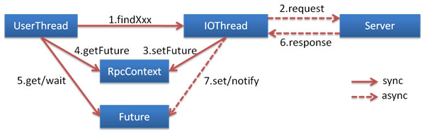

# 一、大纲

- API网关服务聚合
> 一个API网关接口调用多个服务

- Mybatis-plus 自定义sql

- dubbo异步调用

# 二、开发

- 创建影片服务guns-film
- 根据接口文档开发 API网关接口
- 在guns-api中开发影院相关接口FilmServiceApi
```java
// 获取首页
public ResponseVO getIndex

// 影片条件列表查询
 public ResponseVO getConditionList
 
// 影片查询接口
public ResponseVO getFilms

// 影片详情查询接口
publuc ResponseVO getFilmDetail
```

# 三、问题总结

在影片详情getFilmDetail这个接口中，调用了很多服务，如果是同步调用会耗费很长时间，下一个服务调用必须等待上一个服务调用返回
eg:假设接口中调用了4个服务，s1(100ms),s2(200ms),s3(200ms),s4(400ms)
(1)如果使用同步，整个接口完成所需时间为100+200+200+400=900ms
(2)如果使用异步调用，整个接口完成所需400ms
