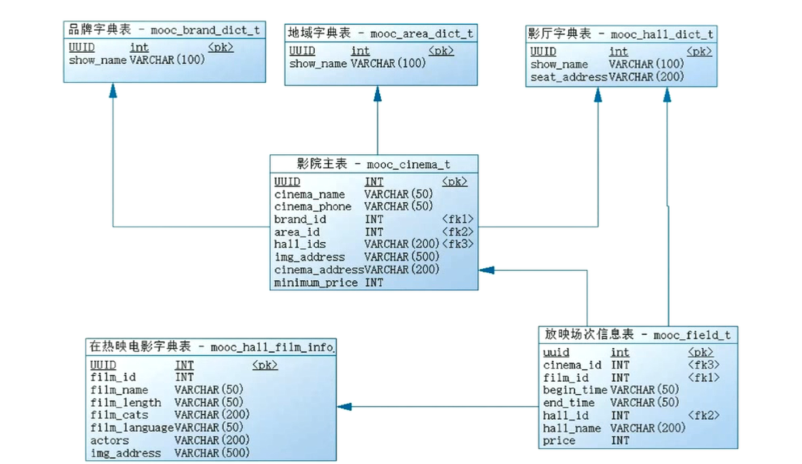

# 大纲

- 完成影院模块开发
- 修改全局异常返回
- dubbo特性：并发控制，结果缓存

# 表结构

# Dubbo特性结果缓存
- 相当于本地缓存，适用于存储数据量小的缓存，缺点，多个机器存同样一份缓存
- 相比于redis等缓存的优点，速度更快
- 缓存热点数据，什么是热点数据，使用频率高，不会经常改变

# Dubbo特性-并发与连接控制
- 并发控制
http://dubbo.apache.org/zh-cn/docs/user/demos/concurrency-control.html
- 连接控制
http://dubbo.apache.org/zh-cn/docs/user/demos/config-connections.html

- tips:
配置服务提供者最大连接数，可以防止过多的请求使得服务挂了
配置并发控制，也就是最大线程数，同样可以防止过多请求，开过多线程，导致服务挂掉
